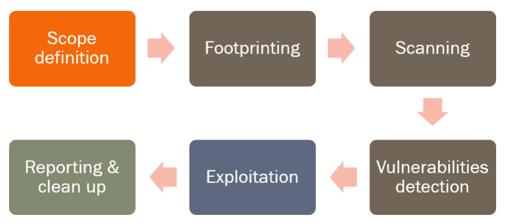
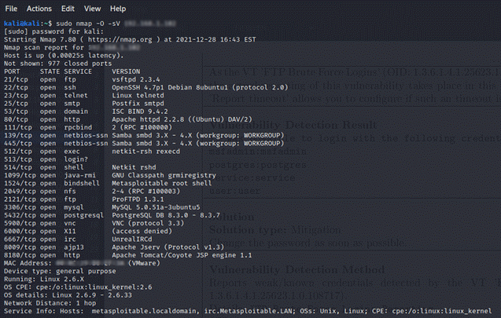
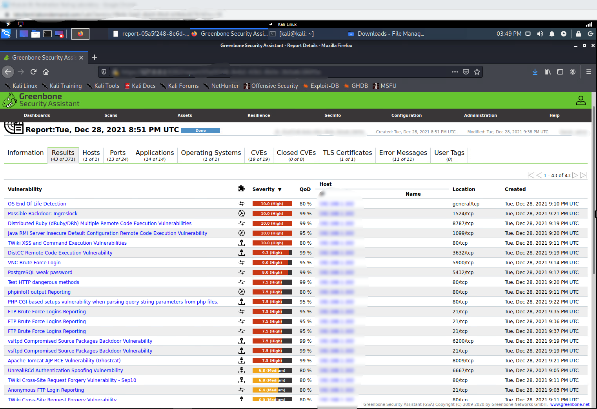

# Summary

The technique of simulating an attack on a computer system with a demonstrated high degree of security is known as penetration testing. Penetration testers are specialists that utilize the same tools, tactics, and procedures that attackers use to uncover weaknesses in a system and explain how these flaws may influence the operation of a company. This is done to determine how dependable the system is. In other words, while testing a system, penetration testers assume the role of an attacker. In certain locations, these individuals are also referred to as "pen testers." When conducting a penetration test, businesses often attempt to replicate potential future assaults. This is done in preparation for eliminating such dangers. These simulations are referred to as "attack scenarios." They can determine if a system is robust enough to survive assaults from multiple roles and authenticated and unauthenticated locations inside the system. This allows them to determine whether or not a system is safe enough to continue operating. As long as the scope of the test is sufficiently broad, a penetration test may examine any aspect of a system.

## 0. Prepreation
### Anonimity
- Use _TOR_ or [_proxychain_](https://github.com/haad/proxychains)
- Change DNS through `/etc/resolv.conf` to something like [OpenDNS](https://use.opendns.com/)
- Change MAC address to prevent exposing any hardware related info; frist [generate one](https://generate.plus/en/address/mac)
```bash
ifconfig -a | grep HWaddr

ifconfig <INTERFACE> down
ifconfig <INTERFACE> hw ether <NEW_MAC_ADDRESS>
ifconfig <INTERFACE> up
ifconfig <INTERFACE> | grep HWaddr
```

## Methodology
A methodology is a set of steps for how to do a penetration test. A penetration test is set up and done in a specific way. There are different ways to do penetration testing, which may show where a company's security is weak. Each approach is different and explains what steps a company can take to find system vulnerabilities. Even though organizations are allowed to make their own processes, there are a lot of tried-and-true methods that are easy to find and may be the best choice for them. Some companies use these methods as "out-of-the-box" solutions, while others use them to grow their businesses.


### Scope Defenition
- An critical part of a system that is being tested for vulnerabilities.
- A purpose that is crystal clear, what is going to be evaluated, and how will it be carried out?
  - In order to make things more clear, you will need to identify the devices, the systems, the networks, the people, and so on.
- To what extent is it possible to take advantage of other people.
  - It is essential in order to avoid disrupting the functioning of any systems that are essential to life.
  - If you are able to make preparations in advance, you will be better able to prevent tragic events.
- The amount of information that was made available to the team that was doing the test.
  - White, Black, and Gray box


 

- Rules of Engagement (ROE)
  The top management of the company such as the CSO, CISO, and CIO, among other roles, and the head of the testing team should sign the plan to verify that they are aware of the test's scope and bounds. This will guarantee the proper execution of the plan.

### Footprinting
- Gather as much information as you can about the company as well as the infrastructure that you wish to use to your advantage.
- Different sources, i.e.
  - doing research on the Internet and browsing through a number of different online newsgroups
  - Job description
  - The provision of services for the management of domain names and associated content.
  - Dumpster digging
  - The art and science of achieving one's objectives via the manipulation of other individuals.
- [OSINT](https://en.wikipedia.org/wiki/Open-source_intelligence) (Open-source intelligence)

### Scanning
- Active machines
- Open ports
- Services
- Operating system details
- Network mapping


### Vulnerabilities Detection
- Identify the weak regions that exist within the target systems.
- Automate tools
  - Perform a scan for security flaws on the systems that are the focus of the attack. (Vulnerability scan)
  - A database that includes the most recent information as well as any vulnerabilities that are already known.
- Manual examination and testing procedures
  - See what happens when you give it wrong inputs, random string combinations, and other things of that kind.
  - Activities carried out by the system that were not anticipated at all


### Exploitation
- Take advantage of a loophole in the system's security in order to get access to the system without authorization.
- Carry out a search on the internet for vulnerabilities, also known as exploits.
  - [Packet Storm](https://packetstormsecurity.com/files/tags/exploit/)
- Frameworks for exploiting vulnerabilities, most often referred to as "exploiters,"
  - [Metasploit](https://www.metasploit.com/), [BeEF](https://beefproject.com/)
- Attacking moves that are both planned and customized
- Retaining one's access while simultaneously expanding one's privileges
- This stage has the potential to provide a significant risk if it is not carried out appropriately.
### Reporting & Clean up
- Results are documented
  - Executive summary
  - A comprehensive [report](img/pentesting-report-sample.pdf) on the technical particulars
- Clean up everything that has been done up to this point in order to bring the testing procedure to a close.
  - Take into consideration everything that occurred while the security check was being carried out.
  - In preparation for the penetration test, doing an assessment of the existing state of things

# Tools and Techniques

## Controls and Best Practices
### Summary
For organizations to use advanced technologies, they need to know what the best cyber security practices are. Cyberattacks have hit both big and small businesses, and they could have been stopped if simple security rules were followed. Patching devices, keeping backups and data recovery up to date, securing VPNs for remote work, and keeping an eye on default passwords are all good things to do.

The way people work from home today makes cyber threats worse. For the first time in the last five years, the most significant challenge facing the public sector is neither a deficiency in training or errors committed by insiders. Companies operating in the public sector are still susceptible to cyberattacks because their capacity to detect and thwart such assaults has not improved.

A cyberattack could be stopped if your company has good security habits. Small security flaws lead to attacks, which mess up the way the company works.
### OWASP Top 10 Checklist
The Open Online Application Security Project, often known as OWASP, is a non-profit organization based all over the world that is focused on the security of web applications. Everyone should have the opportunity to enhance their own web application security, which is why one of the guiding principles of OWASP is that all of their resources should be publicly available on their website and should be straightforward to find. Documentation, tools, movies, and discussion forums are some of the other resources they provide. The [OWASP Top 10](https://owasp.org/images/7/72/OWASP_Top_10-2017_%28en%29.pdf.pdf) is perhaps the project for which they are most known.
#### Injection
Injection attacks occur when untrusted data is supplied to a code interpreter via a web form. An attacker might put SQL database code into a plaintext username form. Unsecured form input would run SQL code. Known as [SQL injection attack](https://www.cloudflare.com/learning/security/threats/sql-injection/).

Validating and cleaning user-submitted data prevents injection threats. Validation rejects dubious data, whereas sanitization cleans it. A database admin may create restrictions to limit the information exposed by injection attacks.
#### Broken Authentication
Authentication (login) system vulnerabilities may enable attackers access to user accounts and compromise a system employing an admin account. An attacker may use a script to attempt thousands of known username/password combinations discovered following a data breach.

[Two-factor authentication (2FA)](https://www.cloudflare.com/learning/access-management/what-is-two-factor-authentication/) and rate restriction may reduce authentication vulnerabilities.
#### Sensitive Data Exposure
If online apps don't safeguard sensitive data, attackers may sell or use it for unscrupulous reasons. On-path attacks are useful for stealing sensitive data.

Encrypting sensitive data and eliminating [caching](https://www.cloudflare.com/learning/cdn/what-is-caching/) reduces data exposure risk. Web developers should avoid keeping sensitive data needlessly.
#### XML External Entities (XEE)
An XML-parsing web program is attacked. This input may reference an external object, exploiting a parser weakness. A hard disk is an external element in this sense. A tricked XML parser may transmit sensitive data to an attacker.

To mitigate [XEE attacks](https://pvs-studio.com/en/blog/terms/6545/#:~:text=An%20XEE%20attack%20is%20a,denial%20of%20service%20(DoS).), online applications should accept [JSON](https://www.json.org/json-en.html) or alter [XML](https://en.wikipedia.org/wiki/XML) parsers to deactivate external entities.
#### Broken Access Control
[Access control](https://www.cloudflare.com/learning/access-management/what-is-access-control/) regulates information or functionality. Broken access restrictions let attackers evade authorisation and act as administrators. A web application might enable a user to alter their logged-in account by changing a url without further verification.

Web applications may safeguard access restrictions by using and controlling authorization tokens.
#### Security Misconfiguration
Misconfigured security is the most prevalent vulnerability, generally caused by default settings or verbose errors. Overly detailed mistakes in a program may identify weaknesses. Remove unneeded code features and make error messages more broad to reduce this.
#### Cross-Site Scripting
[Cross-site scripting](https://www.cloudflare.com/learning/security/threats/cross-site-scripting/) vulnerabilities arise when online applications enable users to add custom code to a url route or website. This vulnerability may launch malicious JavaScript on a victim's browser. An attacker may send a victim an email from a trustworthy bank that links to its website. This URL may contain harmful JavaScript code. If the bank's site isn't secured against cross-site scripting, the link will launch malicious code in the victim's browser.

Cross-site scripting mitigation includes escaping untrusted HTTP requests and validating/sanitizing user-generated content. ReactJS and Ruby on Rails have built-in cross-site scripting security.
#### Insecure Deserialization
Threat targets web apps that serialize and deserialize data. Serialization converts application code objects into a format for storing or streaming data. Deserialization converts serialized data into usable objects. Deserialization is like unpacking and reassembling furniture after a move. Insecure deserialization is like having movers tamper with boxes before unpacking.

Unsecure deserialization may lead to [DDoS assaults](https://www.cloudflare.com/learning/ddos/what-is-a-ddos-attack/) and remote code execution. The only definite method to guard against insecure deserialization attacks is to ban deserialization from untrusted sources.
#### Using Components With Known Vulnerabilities
Developers use libraries and frameworks. These components include React and smaller packages that add share icons or a/b testing. Attackers exploit these components' flaws. Popular components are used on hundreds of thousands of websites; an attacker who finds a security flaw in one might exploit thousands of sites.

Web application developers don't always apply the newest component security patches and updates. Developers should uninstall superfluous components from their apps and use trusted, up-to-date ones to prevent vulnerability.
#### Insufficient Logging And Monitoring
Many online apps don't identify data breaches. Average breach discovery time is 200 days. This allows attackers to create harm before a reaction. OWASP suggests web developers establish logging, monitoring, and incident response procedures to detect application assaults.

### SANS Top 20 Controls
The CIS CSC is a collection of 20 controls (named the [SANS Top 20](https://www.sans.org/blog/cis-controls-v8/)) meant to protect systems and data from known attack vectors. It can help firms without a security program. The CIS Controls are not a substitute for any current compliance scheme, although they map to numerous frameworks and legislation.

The 20 controls represent the expertise of commercial forensics professionals, individual penetration testers, and U.S. government organizations.

#### Authorized And Unauthorized Devices Inventory
Organizations must actively control all hardware devices on the network so only authorized devices have access and unauthorized devices may be swiftly recognized and terminated.

#### Authorized And Unauthorized Software Inventory
Organizations must actively control network software to deploy only approved applications. Whitelisting may help companies detect unlawful software before it's deployed.

#### Hardware And Software Security Configurations
Laptops, servers, and workstations must be secured by companies. To prevent attackers from abusing insecure services and settings, companies must use strong configuration management and change control.

#### Continuous Vulnerability Assessment And Remediation
Organizations must continually collect, analyse, and act on new information (e.g., software updates, patches, security advisories, threat bulletins) to discover and repair network vulnerabilities.

#### Controlling Administrative Privileges
Companies must utilize automated methods to monitor user activity and track administrative rights to prevent unauthorized access to vital systems.

#### Audit Log Maintenance, Monitoring, And Analysis
Organizations must collect, manage, and analyze event logs to investigate security events.

#### Email And Browser Security
To limit their attack surface, organizations must utilize only fully supported web browsers and email clients.

#### Malware Defenses
Organizations must regulate harmful malware installation and execution at many enterprise points. This control proposes regularly monitoring workstations, servers, and mobile devices with anti-virus, anti-spyware, personal firewalls, and host-based IPS.

#### Port, Protocol, And Service Limitations
Organizations must watch and manage network ports, protocols, and services to limit attack windows.

#### Data Recovery
Companies must backup important systems and data regularly. They require a verified data recovery solution.

#### Secure Network Device Configurations
Organizations must configure routers, firewalls, and switches for security.

#### Boundary Defense
Organizations must identify and rectify information flow across networks of various trust levels, focusing on security-harming data. Intrusion detection and prevention systems give the greatest data flow visibility and control.

#### Data Protection
Organizations must employ suitable procedures and methods to protect sensitive data from exfiltration. Encryption, integrity protection, and DLP best safeguard data.

#### Need-To-Know Access Control
Organizations must manage, control, and safeguard access to their essential assets and readily identify which individuals, machines, or apps have access.

#### Wireless Access Control
Wireless LANs, access points, and wireless client systems must be tracked and controlled. They must use network vulnerability scanning tools and verify all wireless devices are configured and secured properly.

#### Account Monitoring And Control
Organizations must actively manage user accounts (creation, usage, deletion) to reduce attack potential. Former contractors and employees' system accounts should be deactivated when they depart the firm.

#### Security Skills Assessment And Training Gaps
Organizations must define specialized security knowledge and abilities. This includes designing and implementing a strategy to identify and repair gaps with policy, planning, and training.

#### Application Software Security
Organizations must manage the software security lifecycle to discover and fix vulnerabilities. They must utilize the latest versions of each program and apply fixes immediately.

#### Incident Management
Organizations must design and execute suitable incident response strategies, roles, training, management supervision, and other steps to detect assaults and contain damage.

#### Red Team And Penetration Tests
The last control requires firms to undertake frequent external and internal penetration tests to examine their defenses (technology, procedures, and people). This helps them detect system weaknesses and attack routes.

## WebApp Tester
Online testing is a type of software testing that checks websites and web apps for errors. Web-based apps go through a lot of testing before they are made available to the public. Before a web-based system can be used by end users, it has to go through thorough testing that looks at all of its parts.

By doing website testing on the platform, a company can make sure that their web-based system works well and can be used by real-time customers. When making a website, the most important things to test are the user interface design and how well it works.
### OWASP Zed Attack Proxy (ZAP)
[OWASP ZAP](https://en.wikipedia.org/wiki/OWASP_ZAP) is a security scanner for web applications that makes use of open-source technology. In addition to being useful for experienced penetration testers, it is meant to be used by those who are new to the field of application security. It is aimed at a diverse range of people.

Start ZAP in ‘inline’ mode with ascii progress bars, attack the target application http://example.com/ and write the report to default output stream:

```
-cmd -quickurl http://example.com/ -quickprogress
```

Start ZAP with UI, attack the target application http://example.com/ and save the report to a file:

```
-quickurl http://example.com/ -quickout /path/to/report.xml
```

[](https://www.youtube.com/watch?v=_VpFaqF0EcI)

### Burp Suite
For the purpose of doing security testing on online applications, [Burp Suite](https://portswigger.net/burp) is an integrated platform and graphical tool. Its many tools operate together in a fluid manner to support the whole of the testing process, beginning with the mapping and analysis of an application's attack surface and continuing all the way to the discovery and exploitation of security flaws.

[](https://www.youtube.com/watch?v=cyWmZ2WgnEE)

## Vulnerability Analyzer
Spotting security flaws in a computer or network requires conducting a vulnerability scan, which is an examination of the many possible entry points into the system. A vulnerability scan identifies and categorizes system vulnerabilities in computer systems, network infrastructure, and communications equipment. It also estimates the degree to which preventative actions will be successful.
### [OpenVAS](https://www.openvas.org/)
Greenbone Vulnerability Manager (GVM) is a software framework that consists of numerous services and tools that allow vulnerability scanning and vulnerability management. OpenVAS (Open Vulnerability Assessment System), which was formerly known as GNessUs, is the scanner component of GVM.

[](https://www.youtube.com/watch?v=LGh2SetiKaY)

### [Nessus](https://www.tenable.com/lp/campaigns/20/try-nessus/?utm_campaign=gs-{11596512905}-{118315026852}-{537515899088}_00023782_fy22&utm_promoter=tenable-hv-brand-00023782&utm_source=google&utm_term=nessus&utm_medium=cpc&utm_geo=emea&gclid=Cj0KCQjw0JiXBhCFARIsAOSAKqBIeNENo09fKaIgf3mvEKmXmCfPyxlXSKwv6CCauhJhG0Q6fJEXhmQaAhOOEALw_wcB)
The company Tenable, Inc. is responsible for the development of the vulnerability scanner known as Nessus.

[](https://www.youtube.com/watch?v=TA1rCRyHRsM)

### [w3af](http://w3af.org/)
Web Application Attack and Audit Framework is what w3af stands for. The purpose of this project is to provide a framework that will assist you in securing your web apps by locating and exploiting any and all vulnerabilities that may exist in online applications.
#### Prerequisites
Make sure you have the following software ready before starting the installation:
Git client: `sudo apt-get install git`
Python 2.7, which is installed by default in most systems
Pip version 1.1: `sudo apt-get install python-pip`
#### [Installation](http://docs.w3af.org/en/latest/install.html#id1)
```
git clone https://github.com/andresriancho/w3af.git
cd w3af/
./w3af_console
. /tmp/w3af_dependency_install.sh
```
[](https://www.youtube.com/watch?v=BuldIS7q_J0)

### [Wapiti](https://wapiti-scanner.github.io/)
Wapiti gives you the ability to examine and analyze the safety of your websites and online apps.
#### Prerequisites
Make sure you have the following software ready before starting the installation:
Git client: `sudo apt-get install git`
Python 2.7, which is installed by default in most systems
Pip version 1.1: `sudo apt-get install python-pip`
Then `pip install wapiti3`
#### Target Scanning
Ran `wapiti -u http://target/`

[](https://www.youtube.com/watch?v=ikiMS0gCDiI)

### [Nikto](https://github.com/sullo/nikto)
Nikto is a web server scanner that is licensed under the GNU Public License (GPL) and performs exhaustive tests against web servers for multiple items. These tests include looking for over 6700 potentially harmful files and programs, checking for outdated versions on over 1250 servers, and looking for version-specific issues on over 270 servers. It also looks for server configuration elements such as the availability of numerous index files, HTTP server settings, and it will try to detect any web servers and applications that have been installed on your computer. The scan items and plugins may be automatically updated, and updates are regularly released for them.
#### Run normally:
```
git clone https://github.com/sullo/nikto
# Main script is in program/
cd nikto/program
# Run using the shebang interpreter
./nikto.pl -h http://www.example.com
# Run using perl (if you forget to chmod)
perl nikto.pl -h http://www.example.com
```
#### Run as a Docker container:
```
git clone https://github.com/sullo/nikto.git
cd nikto
docker build -t sullo/nikto .
# Call it without arguments to display the full help
docker run --rm sullo/nikto
# Basic usage
docker run --rm sullo/nikto -h http://www.example.com
# To save the report in a specific format, mount /tmp as a volume:
docker run --rm -v $(pwd):/tmp sullo/nikto -h http://www.example.com -o /tmp/out.json
```
[](https://www.youtube.com/watch?v=Ux_uOzrvl6g)

- [SubIP](https://suip.biz/?act=nikto)
  Web server scanner that does exhaustive tests on web servers for several things, including checks for outdated versions of over 1250 servers, version-specific issues on over 270 servers, and checks for over 6700 potentially harmful files and programs. It also looks for server configuration elements such as the availability of numerous index files, HTTP server settings, and it will try to detect any web servers and applications that have been installed on your computer.

#### WP Scan
The basic security check looks for WordPress misconfigurations. Basic testing employs web requests. The system downloads a few target pages and analyzes the HTML source.

The aggressive enumeration option searches for plugins/themes and site users. These tests create HTTP 404 errors on the target site. WARNING If you test all plugins, you'll create over 18000 log entries and activate intrusion protection.

Identifying plugins, themes, and users helps you understand the attack surface. You may then test the found resources.
- [SuIP](https://www.whatweb.net/)
  Web technologies such as content management systems (CMS), blogging platforms, statistics and analytics packages, JavaScript libraries, web servers, and embedded devices are acknowledged by WhatWeb.
  WhatWeb includes approximately 1800 plugins, each of which is designed to recognize a distinct kind of content. In addition, WhatWeb is able to recognize version numbers, email addresses, account IDs, web framework modules, and SQL problems, among other things.
- [Wiki Hak](https://www.wikihak.com/wpscan/wordpress-scanner.php)
  Utilizing the Wordpress scanner tool can assist you in finding vulnerabilities that may exist inside your Wordpress website that is hosted online.
- [Hacker Target](https://hackertarget.com/wordpress-security-scan/)
  Online WordPress Security Scanner that examines the installation of WordPress for potential vulnerabilities. Application security, WordPress plugins, hosting environment, and web server are some of the things that are checked.

## Database Tester
A subset of software testing known as database testing examines the schema, tables, triggers, and other components of the database that is being evaluated. Performing a load test or a stress test on the database, as well as checking the database's responsiveness, requires the creation of complicated queries. It verifies the truthfulness and consistency of the data.
### [SQLMap](https://sqlmap.org/)
sqlmap automates the detection and exploitation of SQL injection problems and database server takeovers. It has a robust detection engine, specialist features for the ultimate penetration tester, and a wide variety of switches from database fingerprinting to accessing the underlying file system and executing OS commands through out-of-band connections.
#### Installation
```
git clone --depth 1 https://github.com/sqlmapproject/sqlmap.git sqlmap-dev
```
[](https://www.youtube.com/watch?v=cx6Xs3F_1Uc)

## Information Gathering
When it comes to gaining an understanding of the notion of information collection, the easiest way to characterize it would be the process of collecting information about anything that you have an interest in. A concrete illustration: the process of acquiring information via one's eyes is referred to as "visual perception." In a similar fashion, in the realm of digital technology, a large amount of information may be obtained in a variety of ways, not via your senses, but through a variety of methods, tools, and procedures.

This is the first step that must be taken during the earlier stages of any hacking activity (both cracking and ethical hacking), when any black-hat or white-hat researcher needs to gain as much information as possible about the desired target. For those who work in the cybersecurity industry, this is the first step that must be taken.
### Dorks
#### [Google](https://www.google.com/) And [Bing](https://www.bing.com/?toWww=1&redig=2F5CDCE6BACB4B3B914C2B478E2A7E26)
Google dorking, often referred to as Google hacking, is a technique that may be used to get information that is difficult to find using standard search queries. Using this method, information that was not meant to be available to the general public may be unearthed.
| Google | Bing | Result |
|-|-|-|
| "Search Term" | "Search Term" | Search for the exact phrase within " " |
| - | - | Remove pages that mention a given term from the search results |
| + | + | Force Google to return common words that might ordinarily be discarded |
| OR | OR | Search for a given search term OR another term |
| site: | site: | Search within a given domain |
| filetype: | filetype: | Search for a certain file type |
| intitle: | intitle: | Finds pages that include a specific word as part of the indexed title tag. |
| intext: | intext: | Search for sites with the given word(s) in the text of the page |
| inurl: | inurl: | Finds pages that include a specific keyword in their indexed URLs. |
| inanchor: | inanchor: | Finds webpages that use a specified keyword as anchor text in a link from the page. |
| cache: | cache: | Show most recent cache of a webpage |
| | IP: | Bing only: Finds results based on a given IP address |
| | linkfromdomain | Bing only: Search for links on the given domain |

#### [Yandex](https://yandex.com/)
Runs the most popular search engine in Russia, which has around 65 percent of the market share.
| Yandex | Result |
|-|-|
| "I * music" | Find all results with any word where the asterisk (*) is located |
| `Cheshire cath | atter | Alice` | Remove pages that mention a given term from the Search for any word in query. This query works for Google as well |
| croquet +flamingo | Force Google to return common words that might This query would mandate that the page has the word flamingo, but not croquet |
| rhost:org.wikipedia.* | Reverse host search |
| mime:pdf | Search for specific file type |
| !Curiouser !and !curiouser | Search for multiple identical words |
| Twinkle twinkle little -star | Exclude “star” from search results |
| lang:en | Narrow search by language |
| date:200712*, date:20071215..20080101, date:>20091231 | Narrow search by date or date range |

#### [Shodan](https://www.shodan.io/)
is a search engine that allows users to locate Internet-connected devices as well as sorts of devices. It is possible to search for cameras, routers, Internet of Things and SCADA equipment, among other things.
| Shodan | Result |
|-|-|
| city: | Search for results in a given city |
| country: | Search for results in a given country (2-letter code) |
| port: | Search for a specific port or ports |
| hostname: | Search for values that match the hostname |
| net: | Search a given IP or subnet (e.g.: 192.168.1.0/24) |
| product: | Search for the name of the software identified in the banner |
| version: | Search for the version of the product |
| os: | Search for a specific operating system name |
| title: | Search in the content scraped from the HTML tag |
| html: | Search in the full HTML contents of the returned |

#### [Facebook](https://www.facebook.com/)
The search box enables users to do a search for all profiles that have been established with a certain email address or telephone number.
| Facebook | Query |
|-|-|
| Places, Places visited, Places recently visited, Places checked in, Places liked | /search/UserID/places, /search/UserID/places-visited, /search/UserID/recent-places-visited, /search/UserID/places-checked-in, /search/UserID/places-liked |
| Pages liked | /search/UserID/pages-liked |
| Photos, Photos of, Photos by, Photos liked, Photos commented | /search/UserID/photos, /search/UserID/photos-of, /search/UserID/photos-by, /search/UserID/photos-liked, /search/UserID/photos-commented |
| Apps used | /search/UserID/apps |
| Videos, Videos of, Videos by, Videos liked, Videos commented | /search/UserID/videos, /search/UserID/videos-of, /search/UserID/videos-by, /search/UserID/videos-liked, /search/UserID/videos-commented |
| Events, Events joined in 2010 | /search/UserID/events, /search/str/UserID/events-joined/2010/date/events/intersect |
| Posts, Posts tagged, Posts liked, Posts by year | /search/UserID/stories-by, /search/UserID/stories-tagged, /search/UserID/stories-liked, /search/UserID/stories-by/2010/date/, stories/intersect |
| Friends, Relatives, Followers, Groups, Employers, Co-workers | /search/UserID/friends, /search/UserID/relatives, /search/UserID/followers, /search/UserID/groups, /search/UserID/employers, /search/UserID/employees |
| Page likers | /likers |

#### [Twitter](https://twitter.com/?lang=en)
When you are signed in to twitter, you will have access to a more advanced search. It gives you the ability to customise search results to certain time spans, individuals, and other criteria. Because of this, it is now much simpler to locate certain Tweets.
| Twitter | Find Tweets… |
|-|-|
| twitter search | Containing both "twitter" and "search". This is the default operator |
| "happy hour" | Containing the exact phrase "happy hour" |
| love OR hate | Containing "love" or "hate" (or both) |
| beer -root | Containing "beer" but not "root" |
| #haiku | Containing the hashtag "haiku" |
| from:alexiskold | Sent from user "alexiskold" |
| to:techcrunch | Sent to user "techcrunch" |
| @mashable | Referencing user "mashable" |
| "happy hour" near:"san francisco | Containing the exact phrase "happy hour" and sent from "san francisco" |
| near:NYC within:15mi | Sent from 15 miles of "NYC" |
| superhero since:2010-12-27 | Containing "superhero" and sent since date "2010-12-27" (year-month-day) |
| ftw until:2010-12-27 | Containing "ftw" and sent up to date "2010-12-27" |
| hilarious filter:links | Containing "hilarious" and linking to URLs |
| news source:"Twitter Lite" | Containing "news" and entered via Twitter Lite |
| geocode:47.37,8.541,10km | Sent from 10km from Zurich |

### Antivirus & Blacklist
- [Multi RBL](http://multirbl.valli.org/lookup/)
### [Port Scanner](https://en.wikipedia.org/wiki/Port_scanner)
Port scanners examine servers and hosts for open ports. Administrators may use this tool to evaluate network security rules and attackers to find network services and exploit flaws.

A port scan sends client queries to a host's server port addresses to detect an active port; this is not a malicious procedure.

Most port scans are not assaults, but rather probes to detect distant services.

Portsweep scans many hosts for a listening port. A SQL-based computer worm may portsweep for hosts listening on TCP port 1433.
#### Nmap
Nmap online lets you execute a port scan, obtain information about running services, and search for open ports.

Nmap does this scan. This application scans an IP or URL for open ports and running services. You may select IPs, a range, or a website.

If you provide one website/IP address, results come shortly. If you choose a big range, initial results may take several minutes.

Leave the port blank. The most utilized ports will be checked. You may input a single port, a range of ports separated by a dash, or several ports or ranges. All characters except digits, hyphens, and commas are removed.

Please don't mention too many addresses or ranges since Tor scanning is slow and time is limited. If the scan isn't finished in time, the findings are lost.

If you merely want to scan ports online with Nmap and don't require further settings, use a basic interface.
```
sudo nmap -T3 -A -v -v -v --script intrusive --script-timeout 1h --top-ports 2000 <TARGET> -oX ./results.xml

# convert the XML report to HTML
style="https://raw.githubusercontent.com/honze-net/nmap-bootstrap-xsl/master/nmap-bootstrap.xsl"
xsltproc results.xml $style -o results.html
```

- [SuIP.biz](https://suip.biz/?act=nmap-online)

[](https://www.youtube.com/watch?v=EjOkeacyW3I)

### DNS
DNS is Internet's phonebook. Domain names like google.com provide humans internet access. Web browsers use IP addresses. DNS converts domain names to IP addresses so browsers may access the Internet.

Each device connected to the Internet has a unique IP address. DNS servers reduce the need to know IP addresses like [IPv4](https://en.wikipedia.org/wiki/IPv4) or newer alphanumeric IP addresses like [IPv6](https://en.wikipedia.org/wiki/IPv6).
- [DNS Dumpster](https://dnsdumpster.com/)
  DNS dumpster is a totally free research tool for domains that may identify hosts that are associated with a certain domain. The act of discovering hosts that are visible from the viewpoint of an attacker is an essential aspect of the security assessment process.

  [](https://www.youtube.com/watch?v=zEiLDEZx2CM)
  
- [Security Trails](https://securitytrails.com/domain) provides historical changes of DNS (up to 50 lookup is free)
  ####
  [](https://www.youtube.com/watch?v=NYG6cwL7xi4)

- Online [_subfinder_](https://suip.biz/?act=subfinder)
  This tool locates a significant number of subdomains for the website that you choose as the target.

  The following data sources were consulted during the investigation of website subdomains: Ask, Archive, Baidu, Bing, Censys, CertDB, CertSpotter, Commoncrawl, CrtSH, DnsDB, DNSDumpster, Dnstable, Dogpile, Entrust CT-Search, Exalead, FindSubdomains, GoogleTER, Hackertarget, IPv4Info, Netcraft, PassiveTotal, PTRArch
- Online [_iscloudflare_](https://suip.biz/?act=iscloudflare)
  You are able to determine whether or not CloudFlare is powering a website by using this totally free internet tool. The verification is carried out by the name servers that are being used by the website, and the IP address of the website itself is analyzed to determine whether or not it is a part of the CloudFlare network.
- Online [_cloudfail_](https://suip.biz/?act=cloudfail)
  CloudFail is a tactical reconnaissance tool that seeks to acquire sufficient information about a target that is protected by Cloudflare in the hopes of determining the location of the server. Cloudflare is a content delivery network (CDN) that distributes content over the Internet. The tool, which makes use of Tor to conceal the origin of all queries, now includes three distinct assault stages.

  - DNS scan performed using DNSDumpster.com that found misconfigurations.
  - Perform a search via the database on Crimeflare.com.
  - Comprehensive brute-force search over 2897 subdomains.
- Online [_cbypass-waf_](https://suip.biz/?act=bypass-waf)
  This service uncovers the true IP addresses of websites that are concealed by web application firewalls such as Cloudflare, Incapsula, SUCURI, and others (WAF).

  Examining the history of A records in DNS and analyzing the IP addresses of any subdomains that are discovered are two of the methods that may be used in the search for an actual IP address.

### [Spider Foot](https://www.spiderfoot.net/)
SpiderFoot started as 2005 desktop software. It was popular for years despite only querying five data sources. It was built with the idea that security professionals would benefit from a single interface to gather target information.

A typical organization's attack surface includes on-premise equipment, cloud services, SaaS platforms, and home devices and networks owing to remote work. Add the rising number of services searching the Internet for vulnerabilities and evaluating daily data breaches. OSINT data might be beneficial or bad.

Defenders (and red teams!) need tools to gather and understand this data to assess a target's security posture, whether it's their own company, a client, or an opponent.
#### Installation
SpiderFoot requires Python 3.7 and other `pip` Python libraries.
Then:
```
$ wget https://github.com/smicallef/spiderfoot/archive/v4.0.tar.gz
$ tar zxvf v4.0.tar.gz
$ cd spiderfoot-4.0
$ pip3 install -r requirements.txt
$ python3 ./sf.py -l 127.0.0.1:5001
```
[](https://www.youtube.com/watch?v=jzkFWAUT9ns)

### Header/SSL
There are several components that contribute to the overall security of your website, including SSL Security Headers. Web browsers and servers rely on SSL Headers to assist in protecting the data that is continually sent. SSL is an acronym that stands for "Secure Socket Layer," and what it does is build a one-of-a-kind and confidential encrypted channel for the purpose of transferring data or connecting from a client browser to a server.
- [Mozila Observatory](https://observatory.mozilla.org)
  Over 240,000 websites have benefited from the instruction that the Mozilla Observatory provides to website developers, system administrators, and security specialists on how to setup their websites in a safe and secure manner.
- [Security Headers](https://securityheaders.com/)
  There are services available that will analyze the HTTP response headers of other websites, but I wanted to add a grading system to the findings in addition to those analyses. It is essential for websites to make use of the HTTP response headers since they provide enormously heightened levels of security and are thus being analyzed by this website.

### What Web
The websites are categorized by WhatWeb. It is able to recognize online technologies such as content management systems (CMS), blogging platforms, statistical and analytical software, JavaScript libraries, web servers, and embedded devices. Over 900 distinct plugins are available for WhatWeb, each of which recognizes a different kind of content.
```
whatweb -v <TARGET>
```
[](https://www.youtube.com/watch?v=0Y6nSCj394Q)

- [SuIP.biz](https://suip.biz/?act=whatweb)
This free online WhatWeb service will find out for you such information about   websites as:

  - Server response status code
  - Country of site location
  - Content management system
  - Used IT technologies
  - Server and PHP versions
  - Some other information
- [Hacker Target](https://hackertarget.com/whatweb-scan/)
  A website's fingerprint may be determined by using the WhatWeb and Wappalyzer programs, which are available online. A website's fingerprint can reveal apps, web servers, and other technologies. In order to identify the technologies being used, the tools investigate both the HTTP Headers sent by the web server and the HTML source of a web page.


## Other Tools
- [Geek Flare](https://gf.dev/wordpress-security-scanner)
- [WP Recon](https://wprecon.com/)
- [Pentest Tools](https://pentest-tools.com/website-vulnerability-scanning/website-scanner)
- [Quttera](https://quttera.com/)
- [Up Guard](https://webscan.upguard.com/)
- [Site Guardian](https://www.siteguarding.com/)
- [Sucuri](https://sitecheck.sucuri.net)
- [Immuni Web](https://www.immuniweb.com)
- [Qualys](https://www.qualys.com/apps/web-app-scanning/)
